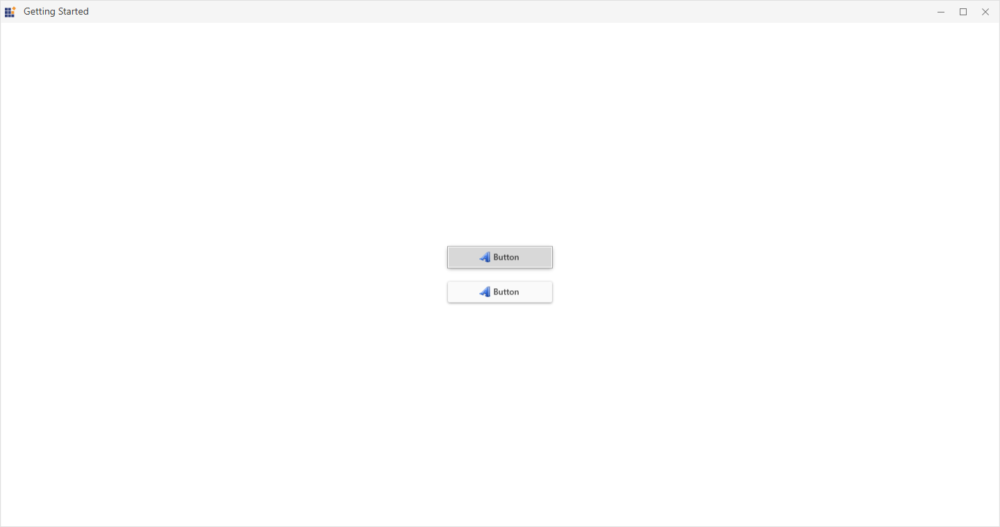

# How to change focus visual kind using WPF SkinManager?

This sample loads [ButtonAdv](https://help.syncfusion.com/wpf/button/getting-started) and [Chromeless Window](https://help.syncfusion.com/wpf/chromeless-window/getting-started) with Reveal focus aka High visibility keyboard visual using SkinManager [FocusVisualKind](https://help.syncfusion.com/cr/wpf/Syncfusion.SfSkinManager.Theme.html#Syncfusion_SfSkinManager_Theme_FocusVisualKind) property.

